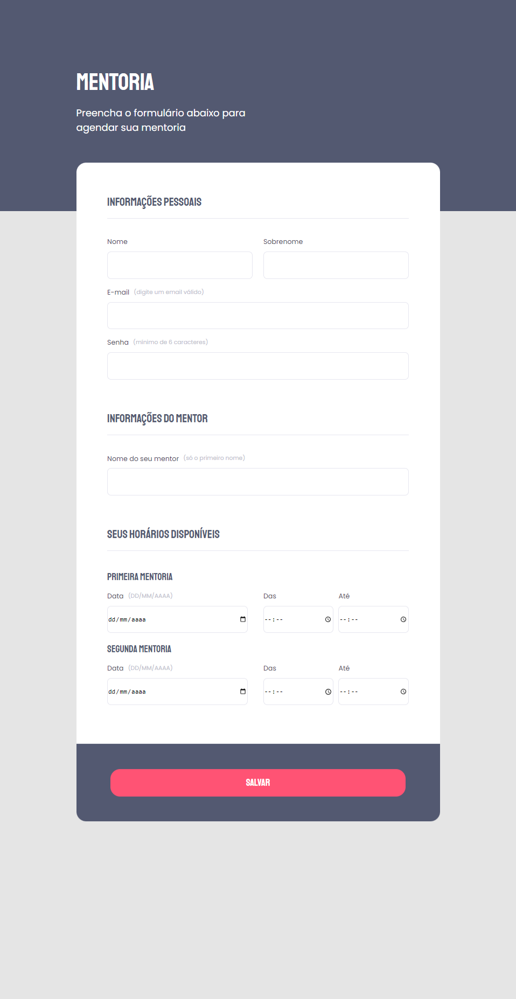

  

	
<h4 align="center"> 
	🚀 Projeto 05 | Stage 03 - Explorer
</h4>

  

  
  
  
  
  <a href="https://laurirodrigues.github.io/Form-Mentoria/"> ▶️ Visualizar Deploy </a>

<h2 align=left> 💻 Sobre o projeto </h3>

 Página de formulário feita durante o programa <strong>Explorer</strong> da <a href="https://www.rocketseat.com.br/"> <strong>Rocketseat</strong> </a>. É o quinto projeto do programa, localizado no nível 3, onde construímos um formulário para fixação de conceitos de HTML e CSS, como estrutura de formulários, inputs, pseudo-classes e validações .

  
<h2 align=left> 🛠 Tecnologias utilizadas </h3>

  
  

<h2 align=left> 🎨 Layout </h2>
<a href="https://www.figma.com/file/H9J3bnwICoaQNUECSXiz09/Stage-03---Formul%C3%A1rio-intermedi%C3%A1rio-(Copy)?node-id=3%3A4"> Visualizar no Figma </a>

<h4>💻 Desktop </h4>

